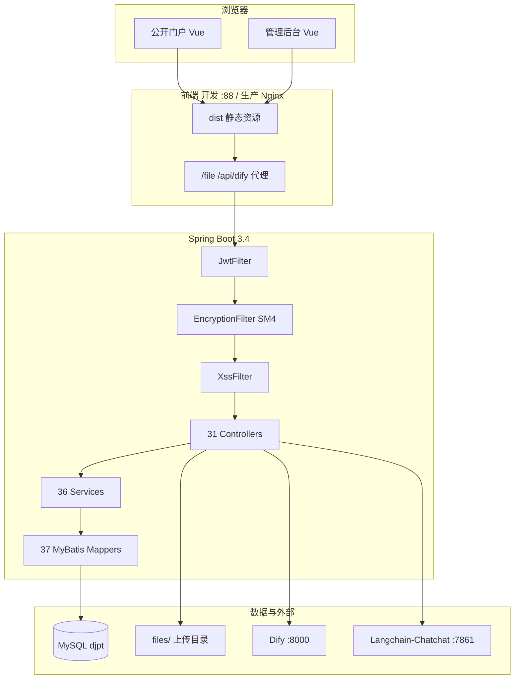

# 基于 AI 对话式交互的党建协同管理系统

> 大学生创新创业训练计划（大创）项目 · 北京电子科技学院  
> 组织仓库：[Party-Building-System/Dachuang](https://github.com/Party-Building-System/Dachuang)

---

## 目录

- [项目简介](#项目简介)
- [系统功能](#系统功能)
- [技术架构](#技术架构)
- [技术栈](#技术栈)
- [仓库结构](#仓库结构)
- [环境要求](#环境要求)
- [快速开始](#快速开始)
- [数据库初始化](#数据库初始化)
- [配置说明](#配置说明)
- [权限模型](#权限模型)
- [演示账号](#演示账号)
- [主要 API 模块](#主要-api-模块)
- [安全机制](#安全机制)
- [AI 能力集成](#ai-能力集成)
- [生产部署](#生产部署)
- [常见问题](#常见问题)
- [相关链接](#相关链接)

---

## 项目简介

本仓库为 **智慧党建平台** 的 monorepo，核心代码位于 [`party-building-system/`](party-building-system/) 目录。

系统面向高校基层党组织，提供 **B/S 架构** 的党建业务信息化能力：资讯发布与多级审核、组织架构与人员管理、党建活动与多媒体资源库、理论学习与在线考试，并集成 **Dify** 等 AI 能力实现党务问答与辅助撰稿。

### 建设目标

| 目标 | 说明 |
|------|------|
| 业务协同 | 拟稿、提交、多级审核、发布一体化 |
| 组织管理 | 部门—支部—党小组—党员层级维护 |
| 活动留痕 | 活动记录、参与统计、资源归档 |
| 理论学习 | 题库维护、组卷、考试与自测 |
| 智能辅助 | AI 对话、敏感词审核、工作流对接 |

### 实现形态

- **前端**：Vue 2 + Element UI，管理后台 + 公开门户
- **后端**：Spring Boot 3 单体应用，REST API
- **数据**：MySQL（库名通常为 `djpt`），大量使用可写视图 `*_view`
- **部署**：Nginx 托管静态资源并反代 HTTPS 后端；可选宝塔面板

---

## 系统功能

### 1. 门户与资讯发布

| 功能 | 说明 | 主要页面/接口 |
|------|------|----------------|
| 公开门户 | 未登录浏览首页轮播、栏目文章 | `/public`、`DefaultView` |
| 文章阅读 | 单篇文章详情与评论 | `/article/:id` |
| 栏目管理 | 树形栏目、拖拽排序、文章调入/移出 | `ColumnSet`、`/column` |
| 富文本撰稿 | 标题、栏目、来源、正文 | `EditorPage`、`wangeditor` |
| 草稿箱 | 保存、编辑、删除、锁定 | `DraftList`、`/draft` |
| 提交审核 | 提交单进入审核流 | `SubmittedDraft`、`/submit` |
| 文章审核 | 待审列表、审核编辑、历史记录 | `DraftAuditList`、`AuditRecord` |
| 审核流程配置 | 流程方案、审核员、栏目绑定 | `AuditProcess`、`/processtype` |
| 评论 | 发表、回复、我的评论、评论审核 | `ComMent`、`/comment` |
| 轮播图 | 首页展示图配置 | `CarouselSet`、`/homePic` |

**稿件业务流程：**

```
草稿 (draft_view)
  → 提交 (submit_view)
  → 多级审核 (process_view + audit_view)
  → 正式发布 (article_view)
```

### 2. 组织与人员

| 功能 | 说明 |
|------|------|
| 人员列表 | 查询、编辑、批量 Excel 导入导出 |
| 个人信息 | 头像、昵称、支部文章统计 |
| 部门管理 | 部门大类（sector） |
| 支部建设 | 党支部、支委会、党小组 |

### 3. 党建活动与资源

| 功能 | 说明 |
|------|------|
| 活动管理 | 按类型 Tab（党员大会、支委会、党小组会、党课、主题党日等） |
| 活动列表 | 按年月分组卡片展示，支持关键字、月份筛选 |
| 活动详情 | 封面、主持人、内容、参与情况 **ECharts 饼图** |
| 封面 | 可上传；无封面时使用默认图（`public/img/default-activity-cover.jpg`） |
| 资源库 | 按活动上传/浏览文件，类型筛选，统计图表 |
| 最近活动图 | 资源页轮播展示最近活动图片 |

### 4. 理论学习与考试

| 功能 | 说明 |
|------|------|
| 试题编辑 | 判断题、选择题、填空题及选项、解析、关键词 |
| 试题搜索 | 按维度、关键字检索 |
| 试卷生成 | 智能/随机/按关键词组卷 |
| 参与测试 | 正式考试答题 |
| 在线自测 | 随机抽题、提交记分 |
| 测评统计 | 各题作答分布图表 |

> 考试模块使用独立表体系（`*_o` 后缀）及 `User2`/`Role`，与党建主账号体系并存。

### 5. AI 能力

| 功能 | 说明 |
|------|------|
| AI 助手 | 党务问答，Markdown 流式渲染（`AiChatPage`） |
| Dify 对接 | Chatflow、内部统计/审核 API、统一 action 执行 |
| 敏感词审核 | 本地词表或 Dify 模式 |
| AI 辅助发文 | 创建内容进入 **草稿审核流**，不直写已发布文章 |

---

## 技术架构



### 端口约定（开发/生产）

| 服务 | 端口 | 说明 |
|------|------|------|
| Vue Dev Server | **88** (HTTPS) | `vue.config.js`，证书 `WebServer.pfx` |
| Spring Boot | **8081** (HTTPS) | 主 API 服务 |
| Spring Boot HTTP | **8082** (HTTP) | 仅本机，供 Dify 容器回调 |
| MySQL | 3306 | 默认 |
| Dify | 8000 | 可配置 |
| Langchain-Chatchat | 7861 | 可选 |

---

## 技术栈

### 后端

| 类别 | 技术 | 版本 |
|------|------|------|
| 语言 | Java | 20 |
| 框架 | Spring Boot | 3.4.2 |
| 安全 | Spring Security + JWT | 无 Session |
| ORM | MyBatis + MyBatis-Plus | 3.0.4 / 3.5.5 |
| 数据库 | MySQL | mysql-connector-j |
| 工具 | Hutool、Apache POI、OkHttp、Jsoup | 见 `pom.xml` |
| 加密 | BouncyCastle SM4 | 传输层 |
| JWT | auth0 java-jwt | 4.3.0 |
| AI（依赖） | Spring AI Ollama、WebMagic | 已引入，业务代码未使用 |

### 前端

| 类别 | 技术 | 版本 |
|------|------|------|
| 框架 | Vue | 2.6.14 |
| UI | Element UI | 2.15.14 |
| 路由 | Vue Router | 3.5.1 (history) |
| HTTP | Axios + SM4 加解密 | 1.6.8 |
| 图表 | ECharts | 5.6.0 |
| 富文本 | wangeditor | 活动/文章 |
| 构建 | Vue CLI | 5.x |

### 运维

| 组件 | 用途 |
|------|------|
| Nginx | 静态站 + 反向代理 + SPA/API 分流 |
| 宝塔 | `deploy/nginx-baota-*.conf` 优化配置 |
| Docker | 可选（仓库未提供 Dockerfile） |

---

## 仓库结构

```
Dachuang/                              # 本仓库根目录
├── README.md                          # 本文档
├── resume.typ                         # 维护者简历（Typst，可选）
└── party-building-system/             # 主工程
    ├── pom.xml                        # Maven 后端
    ├── mvnw / mvnw.cmd
    ├── init.sql                       # PostgreSQL 风格演示数据（勿直接用于 MySQL）
    ├── init_data_mysql.sql            # MySQL 演示数据
    ├── APIs.md                        # 早期 API 说明（部分过时）
    ├── files/                         # 运行时上传目录（gitignore，需本地创建）
    ├── deploy/                        # Nginx 与运维 SQL
    │   ├── nginx-baota-complete.conf
    │   ├── nginx-baota-proxy.conf
    │   ├── nginx-backend-proxy.conf
    │   ├── proxy_common.conf
    │   ├── fix_resource_seed.sql
    │   └── verify_resource_db.sql
    ├── src/main/java/.../dangjian_spring/
    │   ├── Controller/                # 31 个 REST 控制器
    │   ├── service/                   # 36 个服务
    │   ├── entity/                    # 41 个实体
    │   ├── dao/mapper/                # 37 个 Mapper（注解 SQL）
    │   ├── config/                    # Security、Dify、双端口等
    │   ├── filter/                    # Jwt、Encryption、Xss
    │   └── utils/                     # Token、SM4、权限等
    ├── src/main/resources/            # 需本地添加 properties（gitignore）
    └── frontend/                      # Vue 前端
        ├── package.json
        ├── vue.config.js
        ├── .env.development
        ├── .env.production
        ├── public/img/                # 默认活动封面等静态资源
        └── src/
            ├── router/index.js
            ├── utils/request.js       # Axios + SM4
            ├── views/                 # 页面
            └── components/            # 组件
```

---

## 环境要求

| 项 | 要求 |
|----|------|
| JDK | **20** |
| Maven | 3.8+ |
| Node.js | 16+（推荐 18） |
| pnpm / npm | 前端依赖安装 |
| MySQL | 8.0+，字符集 `utf8mb4` |
| 可选 | Dify、Langchain-Chatchat、Ollama |

---

## 快速开始

### 1. 克隆仓库

```bash
git clone https://github.com/Party-Building-System/Dachuang.git
cd Dachuang/party-building-system
```

### 2. 数据库

见 [数据库初始化](#数据库初始化)。

### 3. 后端配置与启动

在 `src/main/resources/` 下创建 **`application.properties`**（该文件被 gitignore，需自行维护）。示例：

```properties
# 数据源
spring.datasource.url=jdbc:mysql://localhost:3306/djpt?useUnicode=true&characterEncoding=utf8&serverTimezone=Asia/Shanghai
spring.datasource.username=你的用户名
spring.datasource.password=你的密码

# JWT 过期（小时）
jwt.expire-hours=2

# HTTPS 主端口（按实际证书配置）
server.port=8081
server.ssl.enabled=true
server.ssl.key-store=classpath:你的证书.pfx
server.ssl.key-store-password=你的口令

# 本机 HTTP 附加端口（Dify 回调，可选）
server.http.port=8082
server.http.address=127.0.0.1
```

创建 **`dify-api-config.properties`**（可选，启用 AI 时）：

```properties
dify.api.enabled=true
dify.api.baseUrl=https://localhost:8081
dify.api.apiKey=你的内部API密钥
dify.api.difyBaseUrl=http://localhost:8000
dify.api.difyApiKey=你的Dify应用Key
dify.api.auditMode=local
dify.api.sensitiveWords=敏感词1,敏感词2
```

启动：

```bash
mvn install
mvn spring-boot:run
```

### 4. 前端配置与启动

```bash
cd frontend
pnpm install    # 或 npm install
pnpm run serve  # 默认 https://localhost:88
```

开发环境变量（`frontend/.env.development`）：

```env
VUE_APP_BASEURL='https://localhost:8081'
VUE_APP_DIFY_IFRAME_URL='http://localhost/v1'
```

`vue.config.js` 已将 `/file`、`/api/dify` 代理到后端，图片等资源建议走 **相对路径** 经 88 端口代理，避免自签证书导致加载失败。

### 5. 准备上传目录与默认静态文件

```bash
# 在 party-building-system 运行目录下
mkdir -p files
# 可将演示图片放入 files/，或依赖 frontend/public/img/default-activity-cover.jpg 作为无封面默认图
```

### 6. 访问地址

| 地址 | 说明 |
|------|------|
| https://localhost:88 | 开发前端 |
| https://localhost:88/login | 管理后台登录 |
| https://localhost:88/public | 公开门户 |
| https://localhost:8081 | 后端 API（直连） |

---

## 数据库初始化

### 执行顺序

1. **`xxfb_mysql.sql`**（建库、建表、建视图）  
   - ⚠️ **不在本 Git 仓库中**，需向项目组获取或从已有环境导出 DDL。  
   - 目标库名：`djpt`。

2. **`init_data_mysql.sql`**（演示数据）  
   ```bash
   mysql -u root -p djpt < init_data_mysql.sql
   ```

3. **`deploy/fix_resource_seed.sql`**（若资源上传报外键错误）  
   - 插入 `acid = -1` 的「未分类活动」。

4. **`deploy/verify_resource_db.sql`**（可选校验）

### 主要数据对象

**信息发布 / 组织（多为 `*_view`）：**  
`chara_view`、`column_view`、`article_view`、`draft_view`、`submit_view`、`audit_view`、`process_view`、`processtype_view`、`user_view`、`sector_view`、`department_view`、`branch_view`、`group_view`、`branch_manager_view`、`comments_view`、`home_show_picture_view`

**活动资源：**  
`activity_view` / `activity`、`participate_view`、`resource` / `resource_view`

**考试（`*_o` 表）：**  
`testpaper_o`、`truefalsequestion_o`、`multiplechoicequestion_o`、`fillintheblankquestion_o`、`keyword_o`、`column2_o`、`participation_o`、`User2`、`Role` 等

---

## 配置说明

### 前端环境变量

| 变量 | 开发 | 生产 |
|------|------|------|
| `VUE_APP_BASEURL` | `https://localhost:8081` | **空**（同源，由 Nginx 反代） |
| `VUE_APP_DIFY_IFRAME_URL` | 本地 Dify | 生产 Chatbot 地址 |

### 生产构建

```bash
cd frontend
npm run build
# 产物在 frontend/dist，由 Nginx root 指向
```

### Git 忽略的重要路径

- `application.properties`、`dify-api-config.properties`
- `files/`、`logs/`
- 证书、`certs/`

---

## 权限模型

角色权限存于 `chara_view.permissions`，为 **7 位字符串**，每位 `1` 表示拥有该权限（下标从 0 开始）：

| 下标 | 常量 | 含义 | 侧栏/路由示例 |
|------|------|------|----------------|
| 0 | HOME_MANAGEMENT | 主页管理 | — |
| 1 | COLUMN_CREATION | 栏目/流程/轮播 | 栏目设置、审核流程、轮播图 |
| 2 | ARTICLE_REVIEW | 文章审核 | 待审文章、审核记录 |
| 3 | ARTICLE_PUBLISH | 文章发布（拟稿） | 草稿箱、提交记录、活动管理（部分路由） |
| 4 | ACTIVITY_MANAGEMENT | 活动管理 | 活动「新增」按钮 |
| 5 | QUIZ | 试题/考试 | 试题管理、理论测试 |
| 6 | USER_MANAGEMENT | 人员管理 | 人员列表、支部、部门 |

前端通过 `localStorage['current-user'].permissions` 与路由守卫 `router.beforeEach` 共同控制菜单与页面访问。

---

## 演示账号

> ⚠️ 仅用于开发演示，**上线前必须修改密码**。

| 用户名 | 密码 | 角色 | permissions |
|--------|------|------|-------------|
| root | root | 管理员 | 1111111 |
| auditor | Zpx20222111 | 审核员 | 0010110 |
| editor | Zpx20222111 | 拟稿员 | 0001110 |
| zpx | Zpx20222111 | 普通用户 | 0000110 |

---

## 主要 API 模块

统一响应：`{ "code": "200", "msg": "...", "data": ... }`（401 等错误可能为明文 JSON）。

| 前缀 | 职责 |
|------|------|
| `POST /login`、`POST /register` | 党建用户登录注册 |
| `/file/upload`、`GET /file/download/**` | 文件上传下载（下载可匿名） |
| `/column` | 栏目 |
| `/article` | 已发布文章 |
| `/draft` | 草稿 |
| `/submit`、`/audit`、`/process`、`/processtype` | 提交与审核流 |
| `/comment` | 评论 |
| `/homePic` | 轮播图 |
| `/user`、`/sector`、`/department`、`/branch`、`/group`、`/branch_manager` | 组织人员 |
| `/activity`、`/resource` | 活动与资源 |
| `/papers`、`/questions`、`/keywords`、`/columns`、`/users`、`/role`、`/batch` | 题库考试 |
| `/api/dify` | Dify 与 AI 业务 API |
| `/chatBot/chat` | Langchain-Chatchat 流式 |

完整接口以各 `Controller` 源码为准；早期说明见 `party-building-system/APIs.md`。

---

## 安全机制

### 过滤器链（顺序）

```
JwtFilter → EncryptionFilter → XssFilter
```

| 机制 | 说明 |
|------|------|
| **JWT** | Header `token` 或 `Authorization: Bearer`；签名密钥为用户密码；默认 2 小时过期 |
| **SM4** | 除 `/file/*`、`/api/dify/*` 外，JSON 请求/响应 CBC 加密；每请求随机 Key/IV |
| **XSS** | 请求体 Jsoup 清洗；跳过 multipart、Dify、文件下载 |
| **Spring Security** | 无 Session；公开路径见 `SecurityConfig` |

### 公开接口（无需登录）

- `/login`、`/register`
- `/file/download/**`
- 部分 `/article/**`、`/column/selectAllToShow`
- `/api/dify/internal/**`（另需 `X-Api-Key` 或 JWT，见 Controller）

---

## AI 能力集成

### Dify（`/api/dify`）

- 用户侧（需 JWT）：文章 CRUD/搜索、统计、评论审核、`POST /chat` 流式对话  
- 内部接口：`/internal/statistics`、`/internal/action-execute` 等  
- AI 生成文章 → 写入 **draft**，走人工审核

### Langchain-Chatchat

- 默认 `http://127.0.0.1:7861`  
- `GET /chatBot/chat` SSE 流式

### Ollama / WebMagic

- `pom.xml` 已声明依赖，README 原说明支持本地 LLM 与爬虫；**当前 Java 业务代码未调用**，需自行扩展。

---

## 生产部署

### 推荐步骤

1. MySQL：DDL + `init_data_mysql.sql` + 按需 `fix_resource_seed.sql`  
2. 配置 `application.properties`、HTTPS 证书、`dify-api-config.properties`  
3. `mvn package` 运行 jar（HTTPS **8081**）  
4. `frontend` 构建：`VUE_APP_BASEURL` 留空  
5. Nginx：参考 `deploy/nginx-baota-complete.conf` 或 `nginx-baota-proxy.conf`  
6. 创建运行目录 `files/`，放置演示或上传文件  

### Nginx 要点

- 静态：`root` → `dist`，`try_files` → `index.html`  
- API：`proxy_pass` → `https://127.0.0.1:8081`  
- **SPA 与 API 分流**：浏览器刷新不带 `SM4-Key` 头 → 走前端；Axios 请求带头 → 走后端  
- 上传限制：`client_max_body_size 100m`  

详细注释见 `deploy/` 下各配置文件。

---

## 常见问题

### 1. 启动报错找不到 `application.properties`

该文件未纳入版本库，请在 `src/main/resources/` 自行创建，参见 [快速开始](#3-后端配置与启动)。

### 2. 资源上传报外键错误（1452）

执行 `deploy/fix_resource_seed.sql`，确保存在 `acid = -1` 的活动记录。

### 3. 活动封面不显示

- 确认 `files/` 下有对应文件，或依赖 `frontend/public/img/default-activity-cover.jpg`  
- 开发环境使用 `/file` 代理，勿直连 8081 自签证书 URL  

### 4. 仅有 `init.sql` 能否建库？

`init.sql` / `init_data_mysql.sql` **只有 INSERT 演示数据**，不含建表语句；必须先有 `xxfb_mysql.sql`（或等价 DDL）。

### 5. 登录后 403

检查用户 `permissions` 与目标路由是否匹配（见 [权限模型](#权限模型)）。

---

## 相关链接

| 链接 | 说明 |
|------|------|
| https://github.com/Party-Building-System/Dachuang | 本仓库 |
| `party-building-system/README.md` | 子项目简要说明 |
| `party-building-system/deploy/` | Nginx 与数据库运维脚本 |

---

## 许可证与声明

本项目为大创训练用途。演示数据含明文密码与测试账号，**禁止直接用于生产环境**。部署前请完成密码策略、HTTPS 证书、敏感配置与数据备份等安全加固。

如有问题，请通过 GitHub Issues 反馈。
